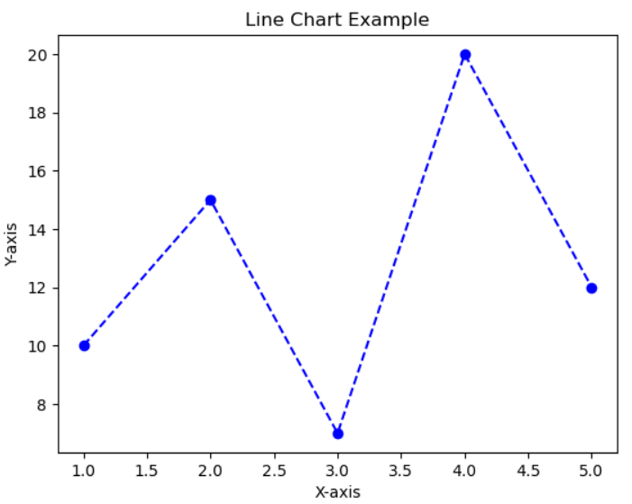
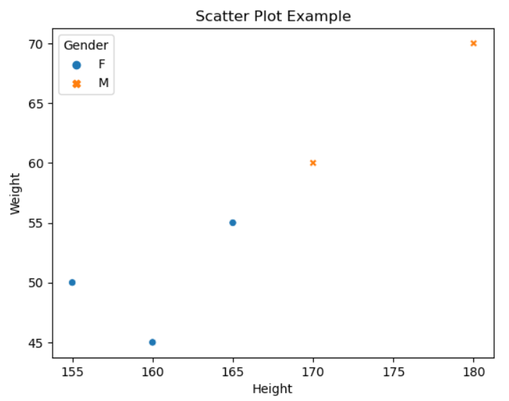

데이터 시각화는 데이터를 시각적으로 표현하여 데이터의 패턴과 관계를 쉽게 파악할 수 있도록 도와주는 중요한 작업입니다. 여기서는 파이썬의 대표적인 데이터 시각화 라이브러리인 Matplotlib와 Seaborn을 사용하여 예제를 통해 간단하게 설명하겠습니다.

**Matplotlib 예제: 선 그래프 그리기**

```python
import matplotlib.pyplot as plt

# 데이터 생성
x = [1, 2, 3, 4, 5]
y = [10, 15, 7, 20, 12]

# 선 그래프 그리기
plt.plot(x, y, marker='o', color='b', linestyle='--')

# 그래프 제목과 축 라벨 설정
plt.title('Line Chart Example')
plt.xlabel('X-axis')
plt.ylabel('Y-axis')

# 그래프 표시
plt.show()
```



위 예제에서는 Matplotlib를 사용하여 간단한 선 그래프를 그리는 방법을 보여줍니다. `x`와 `y` 데이터를 생성하여 `plt.plot` 함수를 사용하여 선 그래프를 그립니다. 그래프의 제목과 축 라벨은 `plt.title`, `plt.xlabel`, `plt.ylabel` 함수를 사용하여 설정합니다. 마지막으로 `plt.show()`를 호출하여 그래프를 표시합니다.

**Seaborn 예제: 산점도 그래프 그리기**

```python
import seaborn as sns
import pandas as pd

# 샘플 데이터 생성
data = {
    'Height': [165, 170, 155, 180, 160],
    'Weight': [55, 60, 50, 70, 45],
    'Gender': ['F', 'M', 'F', 'M', 'F']
}

df = pd.DataFrame(data)

# 산점도 그래프 그리기
sns.scatterplot(data=df, x='Height', y='Weight', hue='Gender', style='Gender')

# 그래프 제목 설정
plt.title('Scatter Plot Example')

# 그래프 표시
plt.show()
```



위 예제에서는 Seaborn을 사용하여 산점도 그래프를 그리는 방법을 보여줍니다. 샘플 데이터를 DataFrame으로 만들고, `sns.scatterplot` 함수를 사용하여 산점도 그래프를 그립니다. `hue`와 `style` 인자를 사용하여 각 데이터의 성별을 구분하여 표시합니다. 마지막으로 `plt.title` 함수를 사용하여 그래프의 제목을 설정하고 `plt.show()`를 호출하여 그래프를 표시합니다.

Matplotlib와 Seaborn은 다양한 종류의 그래프를 그리고 다양한 옵션을 제공하여 데이터 시각화를 더욱 효과적으로 수행할 수 있습니다. 시각화를 통해 데이터의 패턴과 관계를 시각적으로 파악하고 인사이트를 얻는 데 큰 도움이 됩니다.