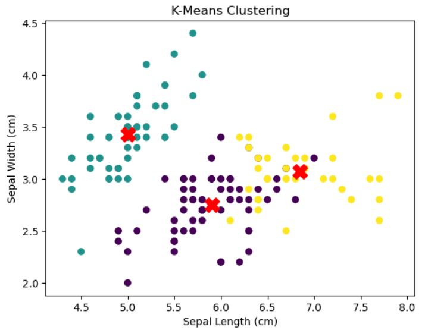

Scikit-learn은 파이썬에서 머신러닝과 데이터 분석을 위한 라이브러리로, 간편하고 효과적인 API를 제공하여 다양한 머신러닝 알고리즘을 지원합니다. 이제 Scikit-learn을 사용한 지도학습과 비지도학습의 예제를 각각 소개하겠습니다.

**지도학습 예제: 붓꽃 품종 분류**

지도학습은 레이블이 있는 데이터를 사용하여 학습하고, 새로운 입력 데이터의 레이블을 예측하는 머신러닝 방법입니다. 붓꽃 품종 분류는 가장 기본적인 지도학습 문제 중 하나로, 붓꽃의 꽃받침과 꽃잎의 길이와 너비를 기반으로 품종을 분류하는 문제입니다.

```python
from sklearn.datasets import load_iris
from sklearn.model_selection import train_test_split
from sklearn.neighbors import KNeighborsClassifier
from sklearn.metrics import accuracy_score

# 데이터 로드
iris = load_iris()
X = iris.data
y = iris.target

# 데이터 분할 (Train, Test)
X_train, X_test, y_train, y_test = train_test_split(X, y, test_size=0.2, random_state=42)

# K-Nearest Neighbors 분류 모델 생성
knn = KNeighborsClassifier(n_neighbors=3)

# 모델 학습
knn.fit(X_train, y_train)

# 예측
y_pred = knn.predict(X_test)

# 정확도 평가
accuracy = accuracy_score(y_test, y_pred)
print("Accuracy:", accuracy)
```

위 예제에서는 붓꽃 데이터셋을 불러오고, 데이터를 학습용과 테스트용으로 분할한 후 K-Nearest Neighbors 분류 모델을 생성하여 학습합니다. 이후 테스트 데이터를 사용하여 예측을 수행하고, 정확도를 평가합니다.

**비지도학습 예제: 군집화 (K-Means Clustering)**

비지도학습은 레이블이 없는 데이터를 사용하여 패턴을 찾거나 데이터를 그룹화하는 머신러닝 방법입니다. 군집화는 비지도학습의 대표적인 예로, 데이터를 유사한 특성을 가지는 그룹으로 나누는 문제입니다.

```python
from sklearn.datasets import load_iris
from sklearn.cluster import KMeans
import matplotlib.pyplot as plt

# 데이터 로드
iris = load_iris()
X = iris.data

# K-Means 군집화 모델 생성
kmeans = KMeans(n_clusters=3, random_state=42)

# 모델 학습
kmeans.fit(X)

# 각 데이터 포인트의 클러스터 할당
labels = kmeans.labels_

# 군집 중심 확인
centers = kmeans.cluster_centers_

# 군집 결과 시각화
plt.scatter(X[:, 0], X[:, 1], c=labels, cmap='viridis')
plt.scatter(centers[:, 0], centers[:, 1], c='red', marker='X', s=200)
plt.xlabel('Sepal Length (cm)')
plt.ylabel('Sepal Width (cm)')
plt.title('K-Means Clustering')
plt.show()
```


위 예제에서는 붓꽃 데이터셋을 불러오고, K-Means 군집화 모델을 생성하여 데이터를 3개의 클러스터로 나눕니다. 이후 데이터 포인트를 군집에 따라 색으로 구분하여 시각화합니다. 또한 군집 중심점을 빨간색의 X로 표시합니다.

Scikit-learn은 지도학습과 비지도학습을 포함하여 다양한 머신러닝 알고리즘과 데이터 처리 기능을 제공하여 머신러닝 모델의 구축과 데이터 분석을 간단하게 할 수 있습니다. 데이터의 특성에 따라 적절한 알고리즘을 선택하고 학습하는 것이 중요하며, Scikit-learn은 이러한 작업을 효율적으로 지원해줍니다.