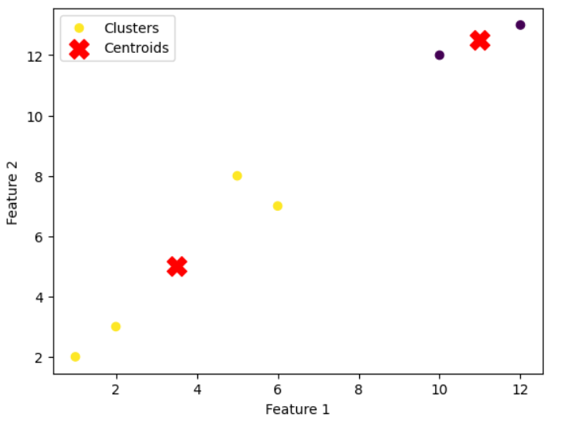

각각의 기본적인 머신러닝 알고리즘인 회귀(Regression), 분류(Classification), 군집화(Clustering)에 대해 예제와 함께 상세하게 설명하겠습니다.

**1. 회귀(Regression):**
회귀는 연속적인 값(종속 변수)과 그와 관련된 특성(독립 변수) 사이의 관계를 모델링하는 머신러닝 알고리즘입니다. 예측하고자 하는 값을 수치로 예측하는 문제에 적용됩니다.

**예제: 단순 선형 회귀**

```python
import numpy as np
import matplotlib.pyplot as plt
from sklearn.linear_model import LinearRegression

# 샘플 데이터 생성
X = np.array([1, 2, 3, 4, 5]).reshape(-1, 1)
y = np.array([2, 3, 4, 5, 6])

# 선형 회귀 모델 생성
model = LinearRegression()

# 모델 학습
model.fit(X, y)

# 예측
X_test = np.array([6, 7, 8]).reshape(-1, 1)
y_pred = model.predict(X_test)

# 결과 시각화
plt.scatter(X, y, label='Actual Data')
plt.plot(X_test, y_pred, color='red', label='Regression Line')
plt.xlabel('X')
plt.ylabel('y')
plt.legend()
plt.show()
```


**2. 분류(Classification):**
분류는 입력 데이터를 여러 개의 클래스 또는 범주로 분류하는 머신러닝 알고리즘입니다. 주로 이진 분류와 다중 분류로 나뉘며, 이진 분류는 두 개의 클래스로 분류하는 문제를, 다중 분류는 두 개 이상의 클래스로 분류하는 문제를 다룹니다.

**예제: 로지스틱 회귀 (이진 분류)**

```python
import numpy as np
import matplotlib.pyplot as plt
from sklearn.linear_model import LogisticRegression

# 샘플 데이터 생성
X = np.array([1, 2, 3, 4, 5, 6, 7, 8, 9, 10]).reshape(-1, 1)
y = np.array([0, 0, 0, 0, 0, 1, 1, 1, 1, 1])

# 로지스틱 회귀 모델 생성
model = LogisticRegression()

# 모델 학습
model.fit(X, y)

# 예측
X_test = np.array([3.5, 7.5]).reshape(-1, 1)
y_pred = model.predict(X_test)

# 결과 시각화
plt.scatter(X, y, label='Actual Data')
plt.plot(X_test, y_pred, color='red', marker='o', linestyle='dashed', label='Predicted Class')
plt.xlabel('X')
plt.ylabel('Class (0 or 1)')
plt.legend()
plt.show()
```


**3. 군집화(Clustering):**
군집화는 레이블이 없는 데이터를 비슷한 특성을 가지는 그룹으로 나누는 머신러닝 알고리즘입니다. 비슷한 특성을 가진 데이터들을 한 그룹으로 묶어서 패턴을 찾고, 유사한 데이터를 분류하는 데 사용됩니다.

**예제: K-Means 군집화**

```python
import numpy as np
import matplotlib.pyplot as plt
from sklearn.cluster import KMeans

# 샘플 데이터 생성
X = np.array([[1, 2], [2, 3], [5, 8], [6, 7], [10, 12], [12, 13]])

# K-Means 군집화 모델 생성
kmeans = KMeans(n_clusters=2)

# 모델 학습
kmeans.fit(X)

# 각 데이터 포인트의 클러스터 할당
labels = kmeans.labels_

# 군집 중심 확인
centers = kmeans.cluster_centers_

# 결과 시각화
plt.scatter(X[:, 0], X[:, 1], c=labels, cmap='viridis', label='Clusters')
plt.scatter(centers[:, 0], centers[:, 1], c='red', marker='X', s=200, label='Centroids')
plt.xlabel('Feature 1')
plt.ylabel('Feature 2')
plt.legend()
plt.show()
```


위 예제에서는 K-Means 군집화를 사용하여 데이터를 2개의 클러스터로 나눕니다. 각 데이터 포인트를 군집에 따라 색으로 구분하여 시각화하고, 군집 중심점을 빨간색의 X로 표시합니다.

이렇게 기본적인 머신러닝 알고리즘을 활용하면 데이터를 학습하고 예측하거나 데이터를 그룹화하여 유용한 정보를 얻을 수 있습니다. Scikit-learn은 이러한 알고리즘을 효과적으로 지원해주므로, 데이터 분석과 머신러닝에 유용하게 활용할 수 있습니다.